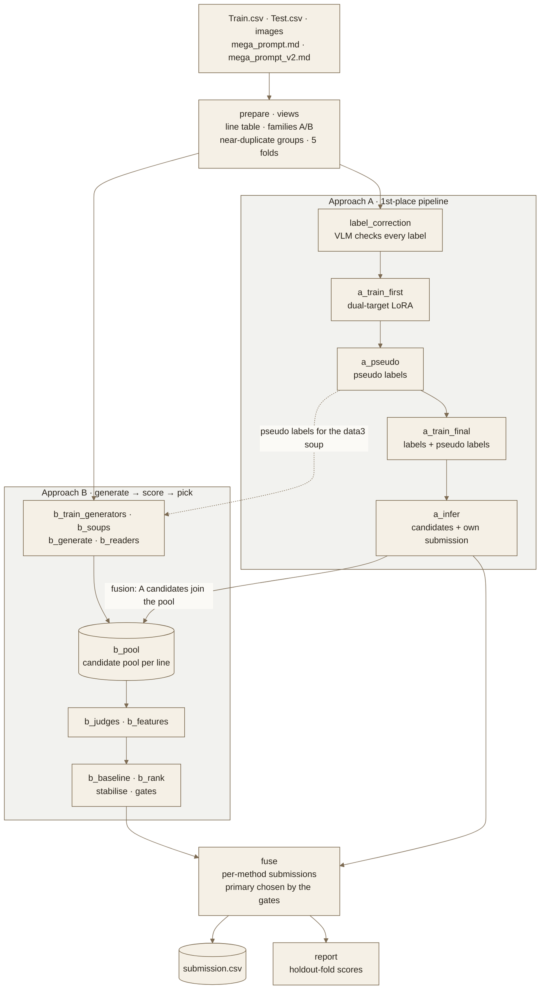
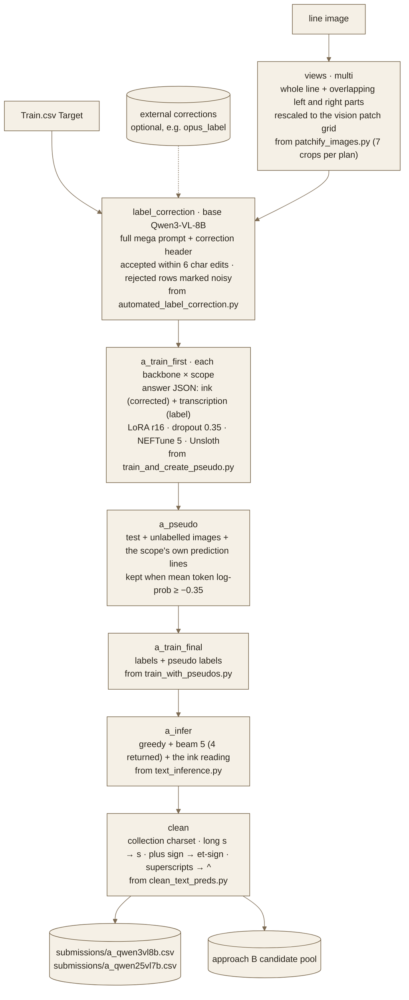
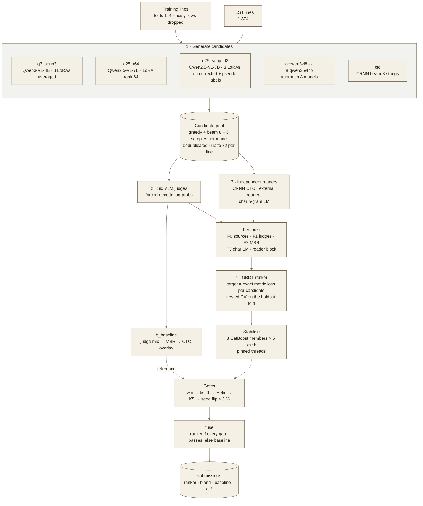
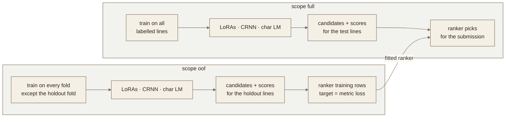

# Barbados-Brainiac workflow

How the pipeline turns `Train.csv`, `Test.csv`, the line images and the two mega prompts into
`submission.csv`: 18 stages run one after another (`bash run_all.sh`), and the two approaches
meet in one candidate pool.

Score: `0.5 · (1 − word edits / 12) + 0.5 · (1 − char edits / 55)` (R.O.A.D. metric).

`docs/workflow.html` is the source of the same diagrams as a styled page.

## Layers

| Layer | What it does | Stages |
|---|---|---|
| Prepare | Builds the line table: split, family A (1639–1668 strips) or B (1669–1710 crops), near-duplicate groups kept in one fold, 5 folds. Renders the model input views. | `prepare`, `views` |
| Approach A | The 1st-place recipe: VLM label correction, dual-target LoRA (ink + transcription), pseudo labels on test and unlabelled images, final LoRA. | `label_correction` … `a_infer` |
| Generate | Fine-tuned VLMs (two soups, one rank-64 LoRA) and the approach A models write about 14 candidate lines each. The CRNN adds beam-8 strings. | `b_train_generators` … `b_pool` |
| Score | Six VLM judges (forced-decode log-probs), the CTC reader and a character n-gram LM score every candidate. | `b_judges`, `b_features` |
| Pick | A gradient-boosted ranker learns from the holdout-fold lines which evidence to trust. The judge-mix → MBR → CTC baseline is its reference. | `b_baseline`, `b_rank` |
| Stabilise | 3 CatBoost members × 5 seeds, averaged within each line, with threads and seeds pinned. | `b_rank` |
| Gates | Twin → tier 1 → Holm → K5 → seed flip ≤ 3 % decide whether the ranker replaces the baseline. | `b_rank` |
| Fuse | Writes one submission per method, fills gaps along the fallback order, and picks the primary by the gates. | `fuse`, `report` |

## End to end

## Approach A · the 1st-place pipeline, adapted to lines

The 1st place trained each field twice in one answer, the corrected value and the annotator's
raw value, and submitted the raw one. Here the model answers with an `ink` reading and a
`transcription` in the annotators' style, and the `transcription` is what gets submitted.

## Approach B · generate, score, pick, stabilise, gates

## Scopes · why the ranker's training data is honest

Every trainable part is built twice. The `oof` models never see the holdout fold, so their
candidates and scores there are fair training data for the ranker. The `full` models serve the
test lines. Parallel copies and duplicate crops of one line share a group and therefore a fold.
